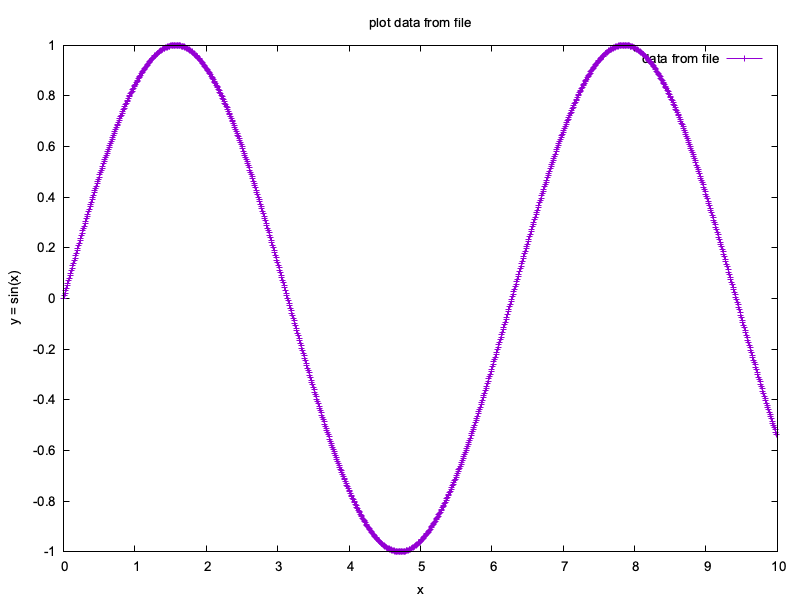

Plotting data
=============

Introduction
------------
In order to display results of our simulations, we will output the results to text and then plot them via a software called ``gnuplot``.
This is not an ideal solution, as we need to also learn some basic ``gnuplot`` commands.
But I believe this is a very simple solution that will work on any system.
For details on ``gnuplot`` see: https://gnuplot.sourceforge.net/

Generating data to plot
-----------------------
As a simple example, we will plot a sinus curve.
This combines knowledge of :doc:`04_functions` and :doc:`05_io` .
The C++ code, that computes :math:`x` and :math:`y=sin(x)` values in a loop and stores them in a ``std::vectot<double>`` and the writes both vectors two a file ``data.dat`` is given below:

.. literalinclude:: ../../../lessons/10_plotting/create_data.cpp
   :linenos:
   :language: cpp

Plotting the data
-----------------

In order to plot the data in ``data.dat``, we need to write a small ``gnuplot``-script, here called ``plot_script.gp``, that describes what we want to plot.

.. literalinclude:: ../../../lessons/10_plotting/plot_script.gp
   :linenos:
   :language: gnuplot

The first lines sets the backend to ``pngcairo`` to output ``*.png`` images and specifies fint attributes.
The second line specifies that the plot should be stored in ``data.png``.
Lines 5-7 define the axis lables and the title.
Line 10 is the actutal plotting command. ``plot 'data.dat' using 1:2`` says that we want to read the data in the ``data.dat`` file and plut the 1st column as x and the secodn column as y.
The later ``with linespoints`` says that we want to have both lines conecting the data points and points.
``title 'data from file'`` specifies the label for the line.
Line 13 is not needed but resets the output to default.

To execute the script, we run

.. code-block:: bash

   gnuplot plot_script.gp

The final image looks like:

